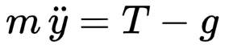
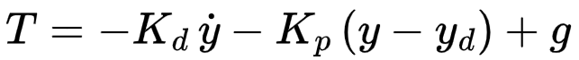
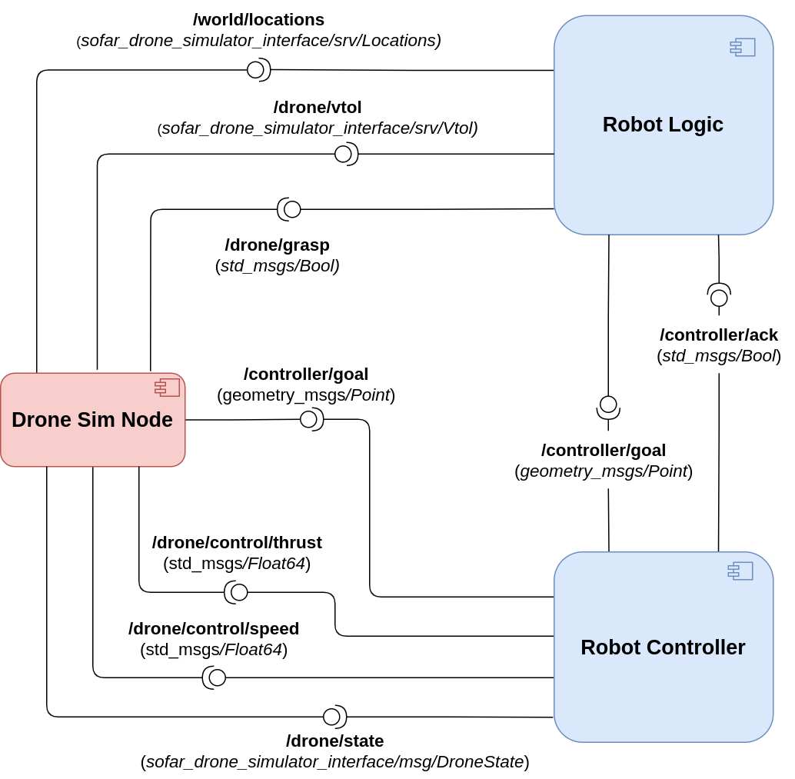

# sofar-drone-simulator
Final exam for the SOFAR 2023 course - July Session. The goal is to control a drone robot in order to perform pick and place operations. Implementation is done via ROS2/Python with the help of the Arcade library.

## Dependencies

The project targets ROS2 distributions. It has been successfully tested with Galactic and Humble distros (desktop installation).

The only external depencency needed is Arcade library (see [Instructions for Linux install](https://api.arcade.academy/en/latest/install/linux.html))

## Execution

Clone the repository in your workspace and compile as usual.

Run the simulation node with the command:

```ros2 run sofar_drone_simulator drone_sim_node```

## Assignment

According to which portion of the exam you need to take, you can focus on specific parts of the assignment:
- If you're taking the full exam, read further, as you will need to implement the full architecture, made up of three nodes.
- If you're taking the pub/sub part only (Part #2), focus on point 2) for the development of the controller.
- If you're taking the client/service part only (Part #3), focus on part 3) for the implementation of the drone logic + you will need to implement the two service interfaces (only the .srv file, the callbacks are already implemented inside *drone_sim_node.py*). To this extent, make sure to analyze the commented code in *drone_sim_node.py* to correctly define the service interfaces. Of course, feel free to de-comment the code once you have provided the interfaces to test your solution.

1) The **drone sim node** is already provided with this repository and acts as the simulator of the drone robot, exposing all the necessary interfaces. Specifically, the drone is tasked with collecting the three boxes and stack them on the empty pedestal.
    1. *Subscribed Topics*
       1) **/drone/control/thrust**: *Float64* message used to control the propellers' thrust and regulate altitude. Further details on the drone's vertical dynamics are given below.
       2) **/drone/control/speed**: *Float64* message used to control the horizontal speed of the drone while flying in the air. This dynamic can be easily controlled through PID as usual.
       3) **/drone/grasp**: *Bool* command used to let the drone grasp or release the closest box. Specifically set the data payload to *True* for grasping and *False* for unloading.
    2. *Published Topics*
       1) **/drone/state**: Custom message used to represent drone's current state, i.e., position and linear velocity in the 2D plane. 
       2) **/controller/goal**: *Point* message used for Vertical TakeOff and Landing (VTOL) operations. Simulation publishes take-off or landing commands upon receiving requests on **/drone/vtol** service.
    3. *Exposed Services*
       1) **/world/locations**: allows for retrieving useful locations to guide the drone in the environment. Specifically, the service returns the hovering location, locations of individual boxes to be grasped and the location of the target pedestal where boxes are stacked.
       2) **/drone/vtol**: allows for executing Vertical Take-Off and Landing operations. Inspect *drone_sim_node.py* to find out about the interface needed to send proper take-off or landing commands.

2) The **controller node**, which controls the drone's dynamic, enabling it to navigate the environment. The simulation implements a simplified version of a quadrotor's dynamics, decoupling vertical and horizontal displacement. Horizontal control is performed as usual through PID controller, as the drone accepts *Float64* commands on the **/drone/control/speed** topic. The drone's altitude, however, is controlled through second-order dynamical system, according to the following equation:



The propellers' thrust, denoted as *T*, counteracts gravity and allows the aircraft to stay afloat. To properly drive the drone to reach and maintain an altitude setpoint, you need to apply the following control law:



Upon reaching a given setpoint (on both axes), the **controller node** publishes an *ack* message to the **robot logic node**, as usual.

3) The **robot logic node**, which acts as *high-level controller*, driving the drone's routine to collect boxes and stack them on the emtpy pedestal. Specifically, the node first queries the simulation through **/world/locations** service to retrieve hovering location, boxes locations and location of the target pedestal. The node then proceeds to invoke the **/drone/vtol** service for take-off, enabling the robot to start its pick-place routine. For each box to collect, the drone will hover over it, then slowly descend to the target position. Boxes are grasped publishing an appropriate message on the **/drone/grasp** topic and later released in the same way. Upon completing the pick-place routine, the drone will navigate back to the initial hovering position and finally invoke once again the **/drone/vtol** service for landing.
Since we're implementing a simplified version, which does not make use of action servers, you may need to add the following code inside you *main* function:

```
logic = RobotLogic()
    
# Spinning thread to make sure callbacks are executed
spin_thread = Thread(target=rclpy.spin, args=(logic,))
spin_thread.start()
```



### Important Notes

**BEWARE: It is mandatory to launch the full simulation using a launch file. SUBMISSIONS NOT INCLUDING A LAUNCH FILE WILL NOT BE EVALUATED!!!**

**SINCE THERE WERE PROBLEMS WITH RENAMING LAST SESSION, THIS TIME IT WON'T BE NECESSARY TO RENAME THE PACKAGES**

**IT IS MANDATORY, HOWEVER, TO INDICATE WHICH PART OF THE EXAM YOU'RE TAKING BY ADDING A TXT FILE INSIDE YOUR SUBMISSION**

Good luck ;)

## Expected Output

